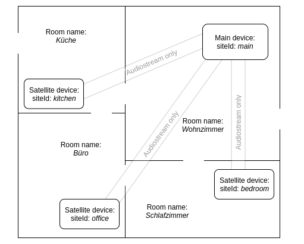

# Snips-Wecker :alarm_clock:
An app for [Snips.ai](https://snips.ai/) with a fully controllable alarm clock.

##### Table of Contents  
[Features](#i-features)  
[Installation](#ii-installation)  
[Configuration](#iii-configuration)  
[Usage](#iv-usage)  
[Troubleshooting](#v-troubleshooting)  
[Coming soon](#vi-coming-soon)  
[Contribution](#vii-contribution)  


## I. Features

- Full multi-room support :house:
- context-awareness: it detects what room you're in :speech_balloon:
- customizable (ringtone sound, volume, ringing timeout, rooms) :wrench:


## II. Installation

:exclamation: The following instructions assume that [Snips](https://snips.gitbook.io/documentation/snips-basics) is
already configured and running on your device (e.g. a Raspberry Pi 3 from the 
[Snips Maker Kit](https://makers.snips.ai/kit/) with 
[Raspbian](https://www.raspberrypi.org/downloads/raspbian/) Stretch Lite). 
[SAM](https://snips.gitbook.io/getting-started/installation) should
also already be set up and connected to your device and your account.

1. In the German [app store](https://console.snips.ai/) add the
app `Wecker & Alarme` (by domi; [this]) to
your *German* assistant.

2. You want to have a more unique alarmclock? Take a look at the section [Configuration](#iii-configuration) below and
see what you can change.

3. Now you may change some parameter values of the alarmclock in the app store.

4. If you already have the same assistant on your platform, update it with:
      ```bash
      sam update-assistant
      ```
      
   Otherwise install the assistant on the platform with the following command to
   choose it (if you have multiple assistants in your Snips console):
      ```bash
      sam install assistant
      ```
    
## III. Configuration

### 1. Normal (single/multi-room)

In the Snips console or manually in the file `/var/lib/snips/skills/Snips-Wecker/config.ini` you can change
some parameters that influence the behaviour of the alarm clock app:

| Parameter name | Default | Range | Description |
|----------------|---------|-------|-------------|
| ringing_volume | 50      | 0 - 100 | Volume of the ringtone |
| ringing_timeout| 30s     | 3s - infinit | Time in seconds for the ringing timeout |
| restore_alarms | yes     | yes/no | Whether the alarms should be restored after reboot |
| ringtone_status | on | on/off | Describes the state of the ringtone. If it's off, only a MQTT message will be sent when the alarm is ringing |

### 2. Multi-room specific

- **Parameter** `dict_site-id`:<br/>
  Important if you have a multi-room setup of Snips! These are pairs of room names and siteIds of these rooms.

  Default: `Schlafzimmer:default`

- **Parameter** `default_room`:<br/>
  Important if you have a multi-room setup of Snips!<br/>
  Here must be the name of the room in which the alarm is to be set, if no room was said in the command.

  Default: `Schlafzimmer`

#### Examples of multi-room configurations

##### Example 1



Parameters values in the [Snips console](https://console.snips.ai/) in this app:

- dict_site-id: `Wohnzimmer:main, Küche:kitchen, Büro:office, Schlafzimmer:bedroom`
- default_room: `Schlafzimmer`

## IV. Usage

### 1. Example sentences

Todo

### 2. While ringing

While an alarm is ringing in a room you can say a hotword in this room, which is by default "Hey Snips!".
The ringtone


### 3. MQTT messages

#### In messages

##### external/alarmclock/in/getAllAlarms

You should subscribe to `external/alarmclock/out/allAlarms` before publishing this message. Then you will get all
alarms.

No JSON Payload required.

##### hermes/external/alarmclock/in/stopRinging

JSON Payload (I'm working on it):

| Key | Value |
|-----|-------|
|siteId	| *String* - Site where the alarmclock should stop ringing|

#### Out messages

##### external/alarmclock/out/newAlarm

JSON Payload: `data` (example access name)

| Key | Value |
|-----|-------|
|new|*JSON Object* - Alarm details: datetime object and siteId (see below: 'new')|
|all|*Dictionary* - Includes all alarms (with the new one; see below: 'all')|

'new' - JSON Object: `data['new']`

| Key | Value |
|-----|-------|
|datetime|*String* - Python object which includes date and time|
|siteId|*String* - Site where the user created the alarm|

'all' - Dictionary: `data['all']`

| Dict-Keys (description) | Dict-Values (description)|
|-----|-------|
|datetime (*String* - Includes date and time; can be parsed into `datetime` object with `strptime` from module `datetime` (see below))|siteId (*String* - Site where the user created the alarm)|

An example parsing with Python is in `examples/exaple_parsing_newAlarm.py`


##### external/alarmclock/out/allAlarms

todo


##### external/alarmclock/out/ringing

JSON Payload:

| Key | Value |
|-----|-------|
|siteId|*String* - Site where the alarmclock is ringing|
|room|*String* - Room name where the alarmclock is ringing|

## V. Troubleshooting

- I can't receive some MQTT messages from the Alarmclock.

    Some MQTT clients may have a package size limit, so you won be able to receive messages with a larger
    payload than the limit size until you increase this. E.g. in the library `PubSubClient` for the Arduino the package
    limit is 128 bytes. In the file `<Arduino libraries folder>/PubSubClient/src/PubSubClient.h` the constant 
    `MQTT_MAX_PACKET_SIZE` must be increased. How much? This depends on how many alarms you will create.

- The time is wrong on my device.

    Make sure that the time and date are correct on your device.

## VI. Coming :soon:

- Clean past alarms at start of app
- Ask for missed alarms [############_]
- New setting: snooze en/disabled (then don't end session)
- Captcha exercises against oversleeping [______________________]
- Internationalisation [###########____]
- Nice README [###_________________]
- Send alarm data over MQTT [###_________________]
- Ability to change the ringtone sound [########__________]
- Maybe: periodical alarms (daily, weekly); before: change clock thread to schedule module


## VII. Contribution

Please report errors and bugs (you can see them with `sam service log snips-skill-server` or on the Pi
with `sudo tail -f /var/log/syslog`) by opening
a [new issue](https://github.com/MrJohnZoidberg/Snips-Wecker/issues/new).
You can also write other ideas for this app. Thank you for your contribution.

Made with :blue_heart:
